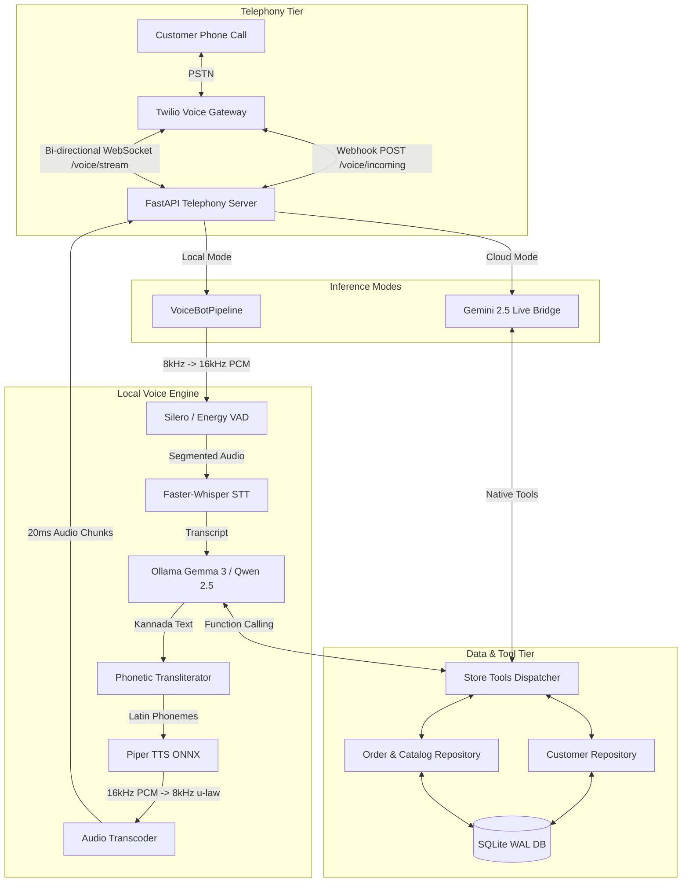

# System Architecture & Technical Design

The **DMart Express Voice-AI Telephony System** is an ultra-low-latency, bilingual (Kannada & English) conversational AI platform designed for automated phone ordering. It supports both a **100% local, zero-API-cost inference stack** and a **cloud-native Gemini 2.5 Multimodal Live bridge**.

---

## 1. High-Level Architecture

The system operates across three decoupled tiers: **Telephony & Network Edge**, **Audio Processing & Voice Engine**, and the **Business Logic & Persistence Layer**.



---

## 2. Audio Processing & Transcoding Pipeline

Twilio Media Streams exchange audio via the **ITU-T G.711 $\mu$-law standard at 8,000 Hz (8kHz)** formatted in 20ms base64-encoded chunks (160 bytes each). Modern speech-to-text and text-to-speech engines expect linear 16-bit PCM at 16,000 Hz (16kHz) or 24,000 Hz (24kHz).

### Audio Transcoding Specification

| Direction | Source Format | Target Format | Processing Mechanism |
| :--- | :--- | :--- | :--- |
| **Inbound (Caller $\to$ AI)** | 8kHz G.711 $\mu$-law (8-bit) | 16kHz Linear PCM (float32) | Look-up table (LUT) $\mu$-law decoding $\to$ Fast linear interpolation resampling |
| **Outbound Local (AI $\to$ Caller)** | 16kHz Linear PCM (WAV) | 8kHz G.711 $\mu$-law (8-bit) | Linear interpolation downsampling $\to$ 65,536-entry nearest-neighbor $\mu$-law LUT |
| **Outbound Gemini (AI $\to$ Caller)** | 24kHz Linear PCM (16-bit) | 8kHz G.711 $\mu$-law (8-bit) | Linear interpolation downsampling $\to$ $\mu$-law LUT |

### Acoustic Echo Suppression & Turn Taking
1. **Initial Tone Discard**: Twilio trial calls generate initial DTMF keypress tones. The server ignores inbound audio for the first 1.0 second of stream connection.
2. **Duplex Echo Suppression**: When the bot audio sender worker is actively writing audio chunks to Twilio, the inbound audio buffer ignores microphone packets. This prevents acoustic loudspeaker bounce from being recognized as caller speech.
3. **Buffer Purging**: Once bot playback completes, the VAD state and audio buffers are reset cleanly before caller speech detection resumes.

---

## 3. Bilingual Kannada & English Engine

The system is built specifically for Kannada-speaking regions (e.g., Bengaluru, Karnataka) and handles code-switching (Kanglish).

```
                      ┌──────────────────────┐
                      │ Caller Speech Audio  │
                      └──────────┬───────────┘
                                 │
                                 ▼
                     Faster-Whisper STT (base)
             [Kannada & English Auto-detection: 'kn'/'en']
                                 │
                                 ▼
               Transcript: "ನನಗೆ 2 ಪ್ಯಾಕೆಟ್ ಹಾಲು ಬೇಕು"
                                 │
                                 ▼
                      Local LLM (Gemma 3)
                   Tool: search_catalog("ಹಾಲು")
                     Returns: Amul Taaza Milk
                                 │
                                 ▼
              Kannada Spoken Text Response:
       "ಖಂಡಿತ, ಅಮೂಲ್ ಹಾಲು ಲಭ್ಯವಿದೆ. ದಯವಿಟ್ಟು ಖಚಿತಪಡಿಸಿ."
                                 │
                                 ▼
                   Phonetic Transliterator
              kannada_to_phonetic_latin()
         Maps Kannada script (U+0C80..U+0CFF)
           to phonetic Latin phoneme string:
          "khandita, amool haalu labhyavide..."
                                 │
                                 ▼
                     Piper TTS (ONNX)
        Synthesizes fluent audio matching Indian cadence
```

---

## 4. Deterministic Caller ID Resolution

When an inbound call arrives at `/voice/incoming`, Twilio transmits caller metadata, including the E.164 phone number (`From`).

1. **Registered Customer**:
   - The phone number is normalized to 10 digits and checked in `customers`.
   - The AI identifies the caller immediately by name (*"ನಮಸ್ಕಾರ Rahul Sharma, ಡಿಮಾರ್ಟ್ ಎಕ್ಸ್‌ಪ್ರೆಸ್‌ಗೆ ಸ್ವಾಗತ!"*).
   - The LLM's system prompt is injected with the customer's pre-registered delivery address and ID.
   - The AI **never asks** for phone number or address during the call.
2. **Unregistered Customer**:
   - Number not found in database.
   - AI greets politely and prompts for name and delivery address.
   - When provided, the LLM atomically executes `register_caller`.
   - The customer profile is created in SQLite, and the call proceeds directly into ordering without restarting.

---

## 5. Dual-Mode Architecture & Cloud-Native Decoupling

The telephony server dynamically selects its execution path based on whether `GEMINI_API_KEY` is present:

### A. 100% Local Inference Mode (Offline Laptop Mode)
- **Zero API Costs**: Runs entirely on consumer hardware with no external network dependencies.
- **Lazy Loading**: If `GEMINI_API_KEY` is empty, the server imports `src.pipeline.bot_pipeline` and loads models into memory at startup.
- **Components**:
  - **STT**: `faster-whisper` (multilingual `base`, int8 CPU/GPU with Silero VAD).
  - **LLM**: Local `ollama` instance (`gemma3:latest` or `qwen2.5:7b`).
  - **TTS**: `piper-tts` (`en_US-lessac-medium` ONNX model with phonetic Kannada transliteration).
- **RAM Footprint**: ~4 GB – 8 GB (due to ONNX acoustic models, Whisper weights, and Ollama model context).

### B. Gemini 2.5 Multimodal Live Mode (Cloud Native on Render)
- **Ultra-Lightweight (~90 MB – 110 MB RAM)**: When `GEMINI_API_KEY` is configured (e.g. on Render Free Tier), heavy local libraries (`faster-whisper`, `piper-tts`, `ollama`) are **never imported or loaded**.
- **Direct Speech-to-Speech**: Inbound 8kHz $\mu$-law audio is transcoded to 16kHz PCM and streamed directly to Gemini Live over a persistent WebSocket session (`gemini-2.5-flash-native-audio-latest`).
- **Sub-Second Turnaround**: The AI begins producing 24kHz synthesized audio bytes before the entire sentence has finished generating.
- **Acoustic Barge-in**: When the caller speaks while the bot is talking, Gemini emits an `interrupted` event and the bridge immediately sends an empty `{"event": "clear"}` frame to Twilio to flush the audio buffer.
- **Native Tool Calling**: Gemini invokes `search_catalog`, `check_stock`, `place_order`, and `register_caller` using JSON declarations; results are queried against SQLite and returned via `session.send_tool_response()`.

---

## 6. Web Dashboard Architecture

The server hosts a lightweight Jinja2-rendered store dashboard on `GET /`:
- **Order Tracking**: Queries `orders` and `order_items` to display real-time order history, customer names, rupee amounts, and dynamic ETAs.
- **Customer Directory**: Displays registered phone numbers and delivery addresses.
- **Interactive Web Simulator**: Enables voice testing via HTML5 Web Audio API directly in the browser without placing a telephone call.
