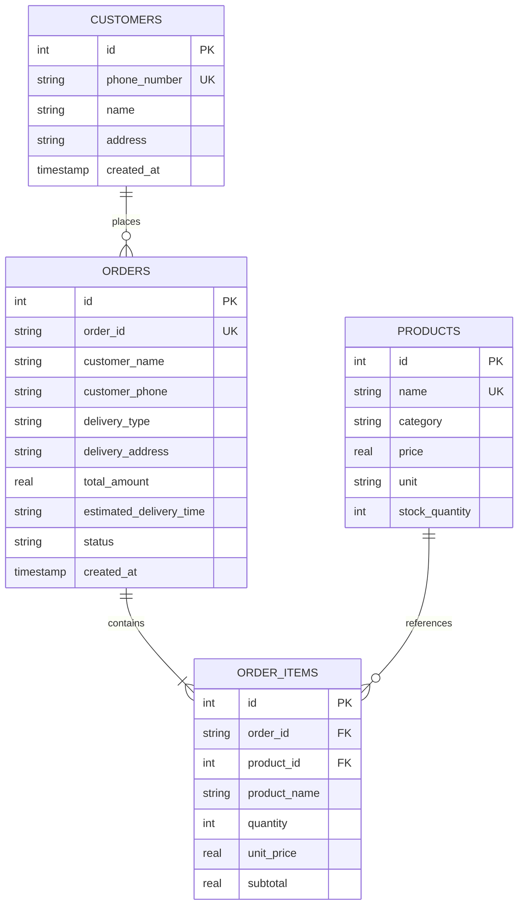

# Database Schema & Data Models

The DMart Express persistence layer is built on SQLite with **Write-Ahead Logging (WAL)** enabled (`PRAGMA journal_mode=WAL;`) and foreign key constraints enforced (`PRAGMA foreign_keys=ON;`).

---

## 1. Entity-Relationship Diagram (ERD)



---

## 2. Table Specifications

### `customers`
Stores customer caller identities, names, and saved street delivery addresses.

| Column | Type | Constraints | Description |
| :--- | :--- | :--- | :--- |
| `id` | `INTEGER` | `PRIMARY KEY AUTOINCREMENT` | Unique customer database ID |
| `phone_number` | `TEXT` | `UNIQUE NOT NULL` | Standardized E.164 or 10-digit phone number |
| `name` | `TEXT` | `NOT NULL` | Customer's full name (English or Kannada) |
| `address` | `TEXT` | `NOT NULL` | Full delivery address in Bengaluru or service area |
| `created_at` | `TIMESTAMP` | `DEFAULT CURRENT_TIMESTAMP` | Registration timestamp |

- **Indexes**: `idx_customers_phone ON customers(phone_number)`

#### Pre-Seeded Customers (Out-of-the-Box Testing)
On database initialization (`init_db()`), the following customer profiles are pre-seeded in SQLite:
| Phone Number | Customer Name | Pre-Registered Delivery Address |
| :--- | :--- | :--- |
| `+919876543210` / `9876543210` | Rahul Sharma | Flat 402, Sunshine Heights, Mumbai |
| `+919812345678` / `9812345678` | Priya Patel | House 12, Green Glen Layout, Bangalore |
| `+919765432100` | Ananya Iyer | A-204, Palm Meadows, Whitefield, Bangalore |

Custom verified numbers can also be registered securely without modifying code by defining `TEST_CUSTOMER_PHONE`, `TEST_CUSTOMER_NAME`, and `TEST_CUSTOMER_ADDRESS` in `.env` or cloud environment variables.

---

### `products`
Supermarket grocery inventory containing stock levels, price points, and categories.

| Column | Type | Constraints | Description |
| :--- | :--- | :--- | :--- |
| `id` | `INTEGER` | `PRIMARY KEY AUTOINCREMENT` | Unique product identifier |
| `name` | `TEXT` | `UNIQUE NOT NULL` | Full product name (e.g. `Amul Taaza Toned Milk 1L`) |
| `category` | `TEXT` | `NOT NULL` | Category (`Groceries`, `Dairy`, `Bakery`, `Beverages`, etc.) |
| `price` | `REAL` | `NOT NULL` | Price in Indian Rupees (INR ₹) |
| `unit` | `TEXT` | `NOT NULL` | Measure unit (e.g. `1 Liter`, `1 kg`, `500 g`, `Pack of 6`) |
| `stock_quantity` | `INTEGER` | `NOT NULL DEFAULT 50` | Units available in store |

- **Indexes**:
  - `idx_products_name ON products(name)`
  - `idx_products_category ON products(category)`

---

### `orders`
Header table for customer orders.

| Column | Type | Constraints | Description |
| :--- | :--- | :--- | :--- |
| `id` | `INTEGER` | `PRIMARY KEY AUTOINCREMENT` | Internal order ID |
| `order_id` | `TEXT` | `UNIQUE NOT NULL` | Customer-facing reference (e.g. `DMART-A045`) |
| `customer_name` | `TEXT` | `NOT NULL` | Resolved or provided customer name |
| `customer_phone` | `TEXT` | `NOT NULL` | Customer contact number |
| `delivery_type` | `TEXT` | `NOT NULL` | `delivery` or `pickup` |
| `delivery_address`| `TEXT` | `NULLABLE` | Street delivery address |
| `total_amount` | `REAL` | `NOT NULL` | Total order value including delivery fee |
| `estimated_delivery_time` | `TEXT` | `NULLABLE` | Spoken ETA window (e.g. `30 to 40 minutes (approx 9:45 PM)`) |
| `status` | `TEXT` | `NOT NULL DEFAULT 'CONFIRMED'` | `CONFIRMED`, `DELIVERED`, or `CANCELLED` |
| `created_at` | `TIMESTAMP` | `DEFAULT CURRENT_TIMESTAMP` | Timestamp order placed |

- **Indexes**: `idx_orders_phone ON orders(customer_phone)`

---

### `order_items`
Line item records associated with an order.

| Column | Type | Constraints | Description |
| :--- | :--- | :--- | :--- |
| `id` | `INTEGER` | `PRIMARY KEY AUTOINCREMENT` | Line item ID |
| `order_id` | `TEXT` | `REFERENCES orders(order_id) ON DELETE CASCADE` | Linked parent order |
| `product_id` | `INTEGER`| `REFERENCES products(id)` | Linked product ID |
| `product_name` | `TEXT` | `NOT NULL` | Snapshot of product name at order time |
| `quantity` | `INTEGER`| `NOT NULL` | Quantity purchased |
| `unit_price` | `REAL` | `NOT NULL` | Snapshot of unit price |
| `subtotal` | `REAL` | `NOT NULL` | `quantity * unit_price` |

---

## 3. Phone Number Normalization

Phone numbers can be received in various formats from Twilio or user input (`+919876543210`, `9876543210`, `09876543210`). The `normalize_phone` routine standardizes them:

```python
def normalize_phone(phone: str) -> str:
    digits = re.sub(r"\D", "", phone)
    if len(digits) == 12 and digits.startswith("91"):
        digits = digits[2:]
    elif len(digits) == 11 and digits.startswith("0"):
        digits = digits[1:]
    return digits
```

During caller lookups, candidates `[raw, norm, +91{norm}, 0{norm}]` are matched against `customers.phone_number` in a single query.

---

## 4. Semantic Synonyms & Bilingual Kannada Mapping

To resolve general speech intents (e.g., *"ಹಾಲು ಮತ್ತು ಬ್ರೆಡ್ ಬೇಕು"*, *"ಚಹಾ ಪುಡಿ"*, *"breakfast"*), `SEMANTIC_SYNONYMS` maps colloquial words to catalog items:

| Spoken Term (Kannada / English) | Mapped Keywords | Target Products |
| :--- | :--- | :--- |
| `ಹಾಲು` / `haalu` / `milk` | `["milk", "amul taaza", "amul gold"]` | Amul Taaza Toned Milk, Amul Gold Milk |
| `ಚಹಾ` / `ಟೀ` / `chai` / `tea` | `["tea", "sugar", "milk"]` | Red Label Tea, Taj Mahal Tea, Sugar, Milk |
| `ಸಕ್ಕರೆ` / `sakkare` / `sugar` | `["sugar", "madhur"]` | Madhur Pure & Hygienic Sugar 1kg |
| `ಅಡುಗೆ ಎಣ್ಣೆ` / `enne` / `oil` | `["sunflower oil", "mustard oil"]` | Fortune Sunlite Sunflower Oil, Mustard Oil |
| `ತಿಂಡಿ` / `tindi` / `breakfast` | `["bread", "eggs", "butter", "milk"]` | Britannia Bread, Fresh Eggs, Amul Butter |
| `ಕಾಫಿ` / `coffee` | `["coffee", "nescafe", "bru"]` | Nescafe Classic, BRU Instant Coffee |
| `ತರಕಾರಿ` / `tarakari` / `vegetables` | `["onions", "potatoes", "tomatoes"]` | Fresh Onions, Potatoes, Tomatoes |
| `ಸಾಬೂನು` / `ಸೋಪು` / `soap` | `["soap", "dettol"]` | Dettol Original Soap (Pack of 3) |

---

## 5. Pricing & Delivery Rules

Defined in `src/config.py`:
- `MINIMUM_ORDER_VALUE`: ₹250.0
- `DELIVERY_FEE`: ₹30.0 (applied on orders below threshold)
- `FREE_DELIVERY_THRESHOLD`: ₹800.0 (delivery fee waived)
- `DEFAULT_ETA_WINDOW`: Current time + 30–40 minutes dynamically calculated and formatted (e.g. `approx 9:45 PM`).
